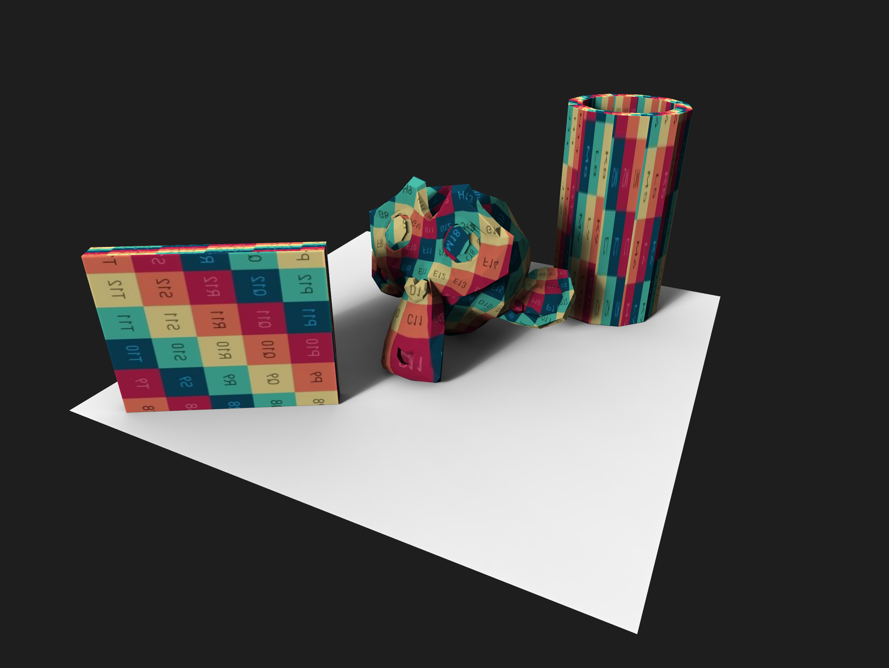
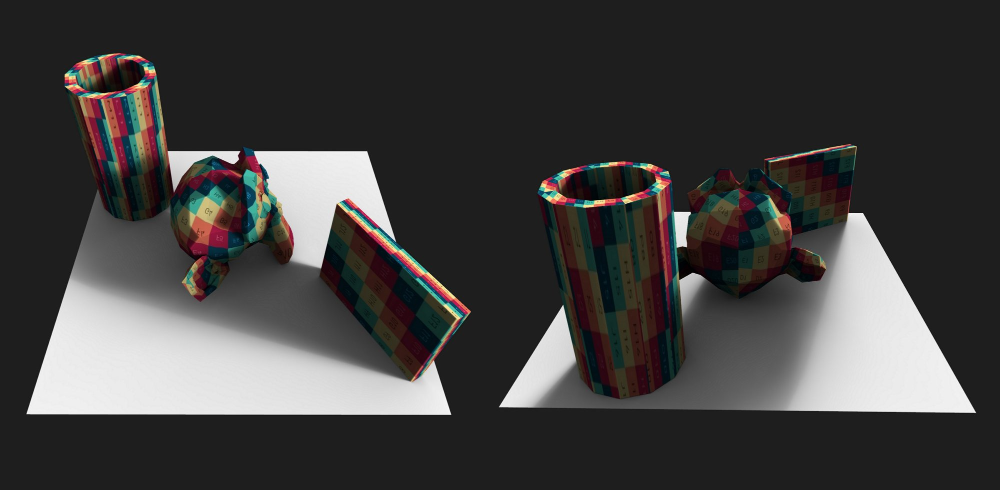
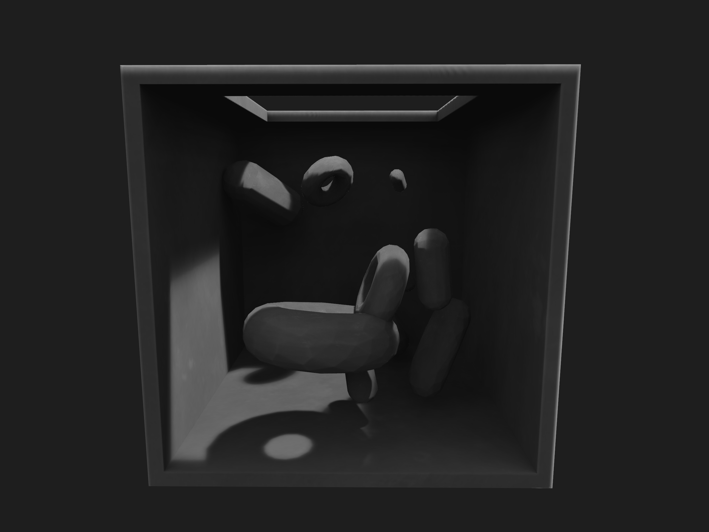
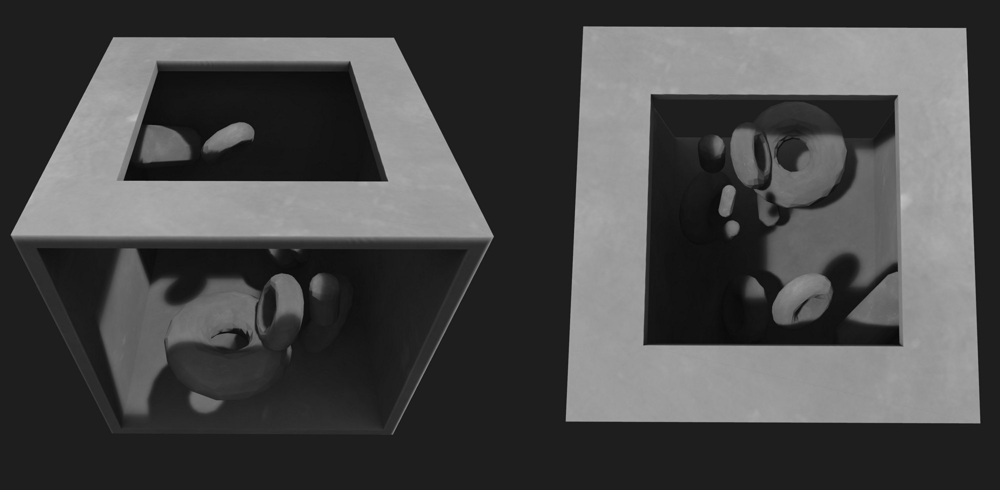
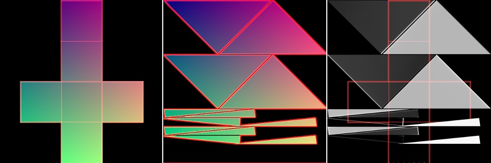

# GPU Lightmapper
A simple OpenGL ambient light baker for OpenFrameworks.

### About

**ofxGPULightmapper** combines different techniques to generate fast and smooth ambient shadows and textures.


 


 


### Usage

```c++
// instance ofxGPULightmapper
ofxGPULightmapper lightmapper;

ofMesh mesh; 	// Mesh model
ofNode node;	// Model world transformation
ofFbo lightmap; // Lightmap texture
ofLight light;	// Sun light

// set up lightmapper and pass scene draw function
function<void()> scene = bind(&ofApp::renderScene, this);
lightmapper.setup(scene, 10); // 10 light pases

// setup lightmap
lightmapper.allocateFBO(lightmap);

// Bake scene light into the lightmap using geometry
lightmapper.updateShadowMap(light, {0,0,0}, 0.5, 10, 0.01, 20);
lightmapper.bake(mesh, lightmap, node, sampleCount);

// Draw geometry with baked light
lightmap.getTextureReference().bind();
mesh.draw();

```


#### VBO Mesh, Triangle Packer and UV spaces

The library can work both with **ofMesh** and **ofVboMesh** being the last one an advantage due the ability to create custom Vertex Buffer. 

For Light baking, it's important that the geometry have a proper UV map. When the assets to be baked have no UV coords or the the UV texture coords are set for a *LUT* or share texture areas, ofxGPULightmapper allows generating a set the coordinates suitable for a Light Map and handles separately the coordinates of the model's textures and the coordinates of the lightmapper.

```c++
// Mesh model [VBO]
ofVboMesh mesh;
// Generate lightmap coords for the model
lightmapper.lightmapPack(mesh);

/*
 * baking
 */

// Draw geometry with texture and baked light
material.begin();
material.setUniformTexture("texture", texture, 0);
material.setUniformTexture("lightmap", lightmap.getTextureReference(), 1);
mesh.draw();
material.end();
```



**Triangle Packer** by @andsz https://github.com/ands/trianglepacker


#### Custom Light direction, AO and light bounces

For custom control of light direction, utilize the functions *begin/end* `ShadowMap` and *begin/end* `Bake`. The library will manage internally the shadow map and biased matrix.

This technique is useful for calculating ambient occlusion or performing light bounces.

```c++
/* AO baking */
ofLight light;

// For generic AO, light comes from everywhere
glm::vec3 lightDir = glm::sphericalRand(radius);
light.setPosition(lightDir);

// Update ShadowMap 
lightmapper.beginShadowMap(light, 10, 0.01, 100);
{	// draw the scene
    renderScene();
}
lightmapper.endShadowMap();

// Bake light
lightmapper.beginBake(lightmap, sampleCount);
{ 	// draw geometry
    node.transformGL();
    mesh.draw();
    node.restoreTransformGL();
}
lightmapper.endBake(lightmap);
```


